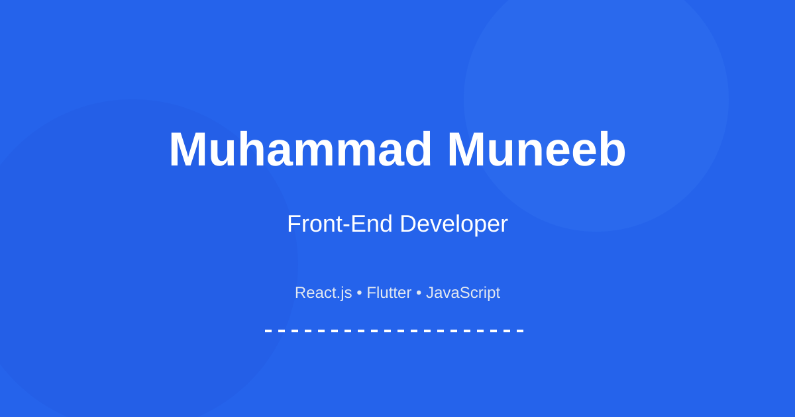

# Muhammad Muneeb - Front-End Developer Portfolio

[](https://github.com/muneeb2346/portfolio/actions)


A modern, responsive portfolio website built with React.js showcasing my projects, skills, and experience as a Front-End Developer.



## ✨ Features

- **Responsive Design** - Fully responsive on all devices (mobile, tablet, desktop)
- **Modern UI/UX** - Clean, professional design with smooth animations
- **Interactive Projects** - Filterable project gallery with detailed modal views
- **Contact Form** - Functional contact form with validation and Formspree integration
- **Performance Optimized** - Lazy loading, code splitting, and optimized images
- **Accessibility** - WCAG compliant with keyboard navigation and screen reader support
- **SEO Ready** - Meta tags, sitemap, and semantic HTML
- **Light Theme** - Clean, professional light theme throughout

## 🛠️ Built With

- **React.js** - Frontend library
- **Vite** - Build tool and development server
- **CSS3** - Styling with CSS variables and modern features
- **Lucide React** - Icon library
- **Formspree** - Form submission handling
- **React Helmet Async** - SEO management
- **Framer Motion** - Animations (optional)

## 📦 Project Structure
portfolio/
├── public/ # Static assets
│ ├── images/ # Image files
│ ├── sitemap.xml # SEO sitemap
│ └── robots.txt # Robots configuration
├── src/
│ ├── components/ # React components
│ │ ├── Header.jsx
│ │ ├── Hero.jsx
│ │ ├── Projects.jsx
│ │ └── ...
│ ├── data/ # Static data files
│ │ ├── resumeData.js
│ │ ├── projectData.js
│ │ └── skillsData.js
│ ├── styles/ # CSS styles
│ │ ├── variables.css
│ │ ├── global.css
│ │ └── components.css
│ ├── utils/ # Utility functions
│ ├── config/ # Configuration files
│ └── App.jsx # Main App component
├── .github/ # GitHub Actions workflows
├── scripts/ # Build scripts
└── package.json # Dependencies


## 🚀 Getting Started

### Prerequisites

- Node.js (v18 or higher)
- npm or yarn

### Installation

1. Clone the repository:
   ```bash
   git clone https://github.com/muneeb2346/portfolio.git
   cd portfolio

2. Install dependencies:
    ```bash
    npm install

3. Create environment file:
    ```bash
    cp .env.example .env

4. Update environment variables in .env:
    VITE_FORMSPREE_ID: Your Formspree form ID

    VITE_SITE_URL: Your site URL

5. tart development server:
    ```bash
    npm run dev
